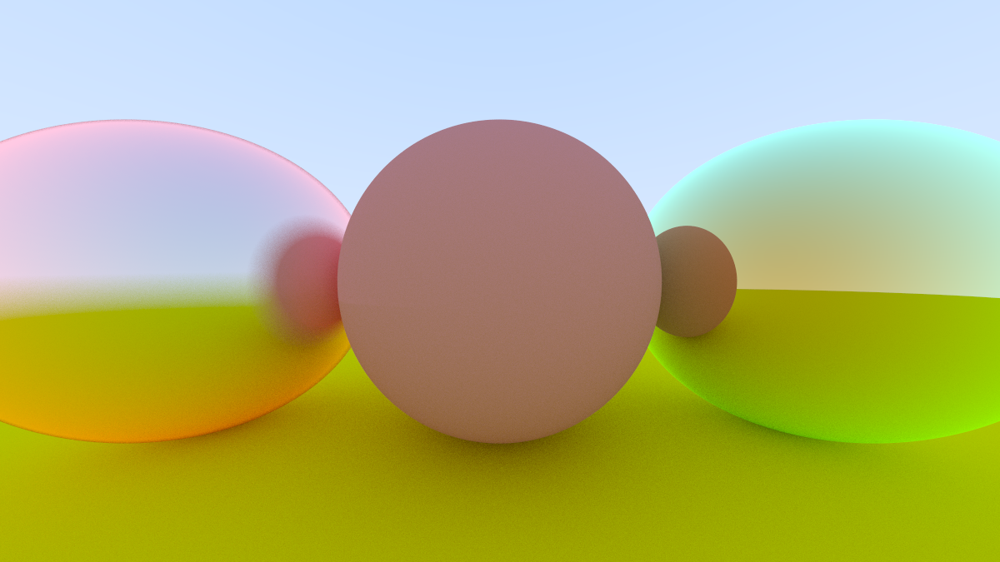

# ray-tracing-in-one-weekend

A ray tracer I'm implementing as a study, based on the book [Ray Tracing in One Weekend](https://raytracing.github.io/books/RayTracingInOneWeekend.html).
I'm adding some custom modifications here and there.

## Custom Modifications
### Fresnel based Rim Lighting

